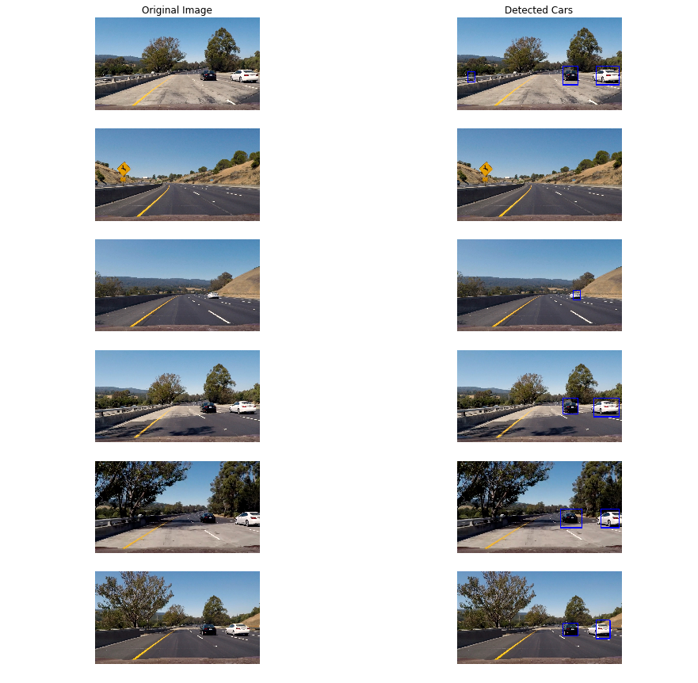

# Vehicle Detection
The goal of this project is to build a pipeline that detects vehicles in a video (to simulate detecting vehicles while on the road).

A classifier will be trained using the following features:
* Histogram of gradients
* Color histogram
* Spatial binning

An image is then searched using sliding windows.  The features of each window are extracted and a prediction is made.  A prediction is made using the previous model.

## Image Features
### Histogram of Gradients
The histogram of gradients code can be found in the third code cell of the Jupyter notebook.

In the `extract_hog_features()` function, scikit-image's [`hog()`](http://scikit-image.org/docs/dev/api/skimage.feature.html#skimage.feature.hog) function is called with the following parameters:
* **orientations:** 9
* **pixels_per_cell:** 8
* **cells_per_block:** 2

These parameters were chosen with accuracy and efficiency in mind.  These specific parameters were popular in the Udacity Slack channel and forums.  More orientations and cells per block and fewer pixels per cell leads to more features to use for classification.  However, a higher number of features also slows down the entire pipeline and increases the chance of overfitting.

When tuning the parameters, I found I ended up with either an overabundance of features or too few parameters (leading to unseen cars).

As recommended by Udacity, its forums and members of its Slack channel, I used the [YCbCr](https://en.wikipedia.org/wiki/YCbCr) color space.  This led to increased accuracy and better generalization.  To increase accuracy, I extracted the HOGs for all three channels.

### Color Histogram
The fourth code cell of the Jupyter notebook features functions to extract color histogram features.

I used the RGB color space and chose 32 bins (as was used in the Udacity lessons).  I did not tune this parameter (as I did not find a need to).

### Spatial binning
The training image itself became a feature.  When classifying, I resized each window to 64x64 and used that as its features.

## Classification
The entire GRI and KITTI datasets were used as training images.  The features were extracted for each of the 8,789 car images and 8,963 non-car images.  Each image has 17,676 features.  The features were scaled and shuffled.  Twenty percent of the dataset was used for testing purposes.  A linear support vector machine was created using scikit-learn's [LinearSVC](http://scikit-learn.org/stable/modules/generated/sklearn.svm.LinearSVC.html) class.  A penalty parameter, C, of 0.1 was used successfully.  It took 71.48 seconds to train the SVC with a test accuracy of 99.16%.

## Searching Images for Cars
A sliding windows search was implemented using code supplied by Udacity.  Choosing the overlap between the windows was tricky.  An overlap that was too large led to a pipeline that took a long time while an overlap that was too small led to cars in the image not being found.

I found the best compromise to be an overlap of 75% (for both the X and Y axes) while searching a fewer number of window sizes (I was initially searching over five different window sizes).

Window sizes are important to find cars that are close to and far away from the camera.  I began with the following window sizes:
* (64, 64)
* (96, 96)
* (144, 144)
* (192, 192)
* (256, 256)

It took a long time to search all five window sizes.  I settled on three window sizes that allowed me to search far away and closer to the camera.  These three window sizes were:
* (80, 80)
* (144, 144)
* (256, 256)

Using these three window sizes with a 75% overlap resulted in finding all cars (including one oncoming car on the other side of the median) in the test images.

To avoid duplicate detections and false positives, a heat map was created.  This heat map started purely black (0) and, for each detected window, the entire span would have 1 added to it.  A threshold of 1 was used to ignore those parts of the heat map with only 1 or 0.  The rest of the map was labeled and a bounding box was drawn over a rectangular portion of the heat map.

The following are test images with boxes drawn over the detected cars (where the heat map went over 1):

## Conclusion
The video featured lines that resized often.  Additionally, when the second car came into the frame, the two cars were grouped into one box (with one label).  These inconsistencies resulted from the use of a heat map.

I believe this can be remedied by saving the centroid of the vehicle and calculating an estimate of where that centroid will be.  Then, the bounding box can remain constant or change sizes given the distance of the centroid.

The final video was uploaded to [YouTube](https://www.youtube.com/watch?v=QdP59fDmkH8).
